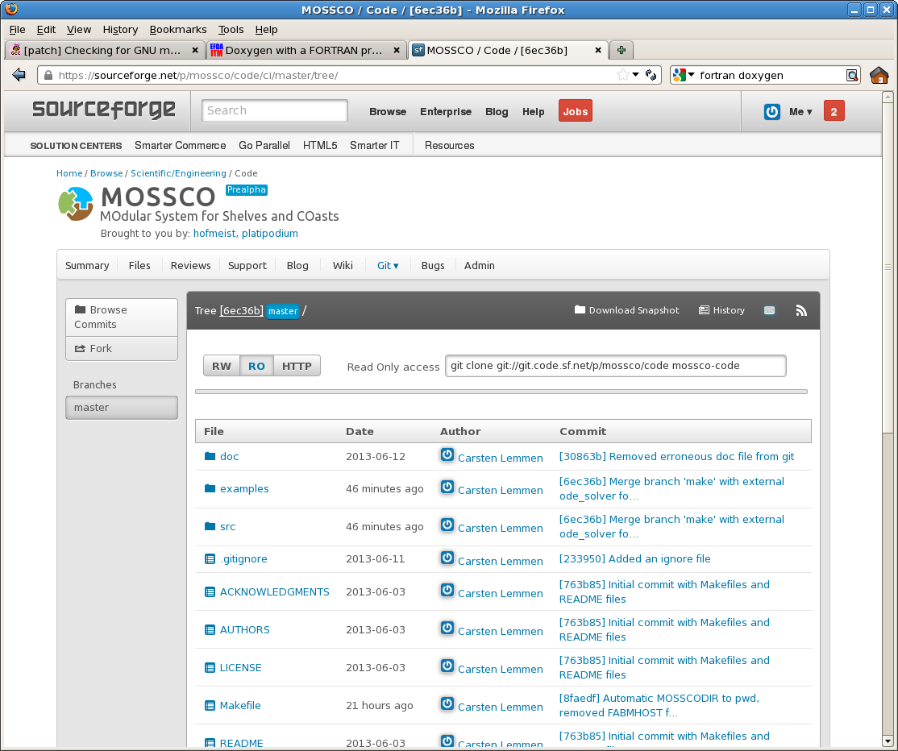

# Obtaining and installing MOSSCO

MOSSCO is distributed *only* as source code. There is no binary package available that we currently distribute.

@section obtain How to obtain the source code

While the public web site with documentation on the MOSSCO project is hosted at <http://www.mossco.de>, the software, blog, and bug tracker is hosted on <http://sf.net/p/mossco> and linked from <http://www.mossco.de>.  To obtain the code, change to the `git` tab at that site, or follow either one of these links <http://www.mossco.de/code> and <https://www.sf.net/p/mossco/code>.

The web site interface could look as follows (depending on your browser):

Choose a local directory `$MOSSCO_DIR`, where you would like the mossco code to reside;  you should make this an environment variable.

		export MOSSCO_DIR=$HOME/some/local/directory # for bash users
		setenv MOSSCO_DIR $HOME/some/local/directory # for csh users

The code is available via  `git` for read-only access. If you don't have  `git`, you can download and install a suitable version from <http://git-scm.com>.

	git clone git://git.code.sf.net/p/mossco/code $MOSSCO_DIR

or, alternatively using the `http` protocol

	git clone http://git.code.sf.net/p/mossco/code $MOSSCO_DIR

If you are a developer and registered as a participant of the MOSSCO project, you may use a modified version of this command to gain write access.

> Note: If you do not have  `git`, you may also download a zipped version of the source code from the `Files` section at <https://sf.net/p/mossco/files/>. Note, however, that these snapshots may be outdated at the time of your download.  Download the file to the directory where `$MOSSCO_DIR` points to, then unzip it.

@section building-mossco Building and installing MOSSCO

@subsection prereqs MOSSCO prerequisites

MOSSCO has some necessary and some optional prerequisites.  Please make sure you meet these prerequisites before you try to compile MOSSCO.

@subsubsection system-prereqs Necessary system prerequisites

Program | Minimum version and alternatives
--------|----------
GNU `make` | 3.0
Fortran 2003 Compiler | e.g. GNU  >= 4.8.3, Intel >= 12.0, PGI >= 13.2
ESMF | 7.0.0

### Optional system prerequisites

Program | Minimum version and alternatives
-------|-----------
NetCDF | 3.6, preferably version 4
Message Passing Interface | OpenMPI >= 1.7 or MPICH >= 3.0.4

We recommend strongly that you delegate the installation of ESMF (including Fortran compiler, MPI, NetCDF) to your local tech support or IT department. Other versions of the necessary and optional required programs may also work, but have not necessarily been tested.  

You may also try to go ahead with an existing lower version of any of the required software packages, report possible errors, and argue why you would like us to support your version.  

For help and hints on installing ESMF, MPI, and NetCDF, see the appropriate sections below.  Please make sure to use the same compiler for all your software components.

1. Choose a FORTRAN compiler
2. Compile MPI for this specific compiler
3. Compile NetCDF libraries with this specific compiler and MPI support
4. Compile ESMF with matching NetCDF and MPI library settings

### Optional external model installations

Program | Minimum version and alternatives
-------|-----------
GOTM | > 13 August 2014
FABM | > 13 August 2014

> GOTM's interface changed on 13 August 2014.  If you use an earlier version of GOTM, the 0D driver will not compile.  FABM development is usually synchronized with GOTM, so make sure you use versions of similar date.

You can easily obtain current versions of GOTM, FABM and several other external programs from within MOSSCO at any time (see below)

### Documentation prerequisites

Program | Minimum version and alternatives
-------|-----------
Doxygen | >= 1.8
Latex | with pdf latex support

There is a pre-built documentation available online at <http://www.mossco.de/doc>

## Installing MPI and NetCDF

Quite likely, a version MPI and NetCDF are preinstalled on your system.  If not, it is preferable to use your package manager (Yast, zypper, apt, port, etc. ...) to install these programs.  Make sure that both MPI and NetCDF are compiled with the *same* Fortran 2003 compiler that you would like to use for ESMF and MOSSCO subsequently. Often, this is not the case (unless you're using a very recent operating system), so please check carefully.  We experienced a lot of difficulties and bugs with outdated compilers, and mismatches between the compiler (and respective libraries) used for the different requirements for MOSSCO. You may also consult the bug data base <http://www.mossco.de/bugs> for solving these problems.

For ESMF, you need the NetCDF C library.  For GOTM and the NetCDF data components in MOSSCO, you need to install the NetCDF Fortran library (if using NetCDF > 4.1.3).

## Installing ESMF

Decide on a directory where to put the ESMF source, and set the environment variable  `$ESMF_DIR` to point to this directory.

1. download the `git` repository of esmf

		git clone git://git.code.sf.net/p/esmf/esmf $ESMF_DIR

2. change to this directory

		cd $ESMF_DIR

3. checkout the ESMF_6_3_0r tagged version

		git checkout ESMF_6_3_0r

4. set ESMF's environment variables (these can be a lot, see below)

An example environment for ESMF could look like this:

Environment variable | value
---|---
ESMF_DIR | $HOME/opt/src/esmf
ESMF_COMM | mpich2
ESMF_NETCDF | split
ESMF_NETCDF_INCLUDE | /opt/local/include
ESMF_NETCDF_LIBPATH | /opt/local/lib
ESMF_LAPACK | netlib
ESMF_PIO | internal

See the ESMF manual for a complete list of ESMF environment variables and their relevance.

Build and install ESMF by issuing  `make`.
For MOSSCO and the ESMF tools to work, you need to define the environment variable `$ESMFMKFKILE`, e.g.

Environment variable | value
---|---
ESMFMKFILE | $HOME/opt/src/esmf/lib/libg/Linux.gfortran.64.mpich2.default/esmf.mk

## FABM, GOTM, GETM

MOSSCO takes care of obtaining a current FABM, GOTM, and GETM.  Go to `$MOSSCO_DIR` and execute

	make external

This will download FABM, GETM, and GOTM to your system in subdirectories of `$MOSSCO_DIR/external`.

Alternatively, you can set environment variables `$FABMDIR`, `$GOTMDIR`, and `$GETMDIR` and then clone the respective `git` repositories

	git clone git://git.code.sf.net/p/fabm/code $FABMDIR
	git clone git://git.code.sf.net/p/gotm/code $GOTMDIR		

### Building FABM

MOSSCO takes care of the FABM built via `cmake`.

### Building GOTM or GETM

GOTM and GETM can be automatically built by MOSSCO if you set the following environment variables:

Environment variable | value
---|---
MOSSCO_GOTMDIR | $GOTMDIR
MOSSCO_GETMDIR | $GETMDIR

Alternatively, you can build GOTM and GETM yourself by specifying the following environment variables (adapt to your local system):

Environment variable | value
---|---
FORTRAN_COMPILER | GFORTRAN
NETCDFHOME | /opt/local
NETCDF4 | true
NETCDF_VERSION | NETCDF4

Then change to the respective directories and issue `make`

	(cd $GOTMDIR/src ; make distclean all)
	(cd $GETMDIR/src ; make distclean all)

## Building MOSSCO

To create the MOSSCO libraries,  simply issue
 `make` in your  `$MOSSCO_DIR`.  This will automaticall build the  src target and provide the libraries in  `$MOSSCO_DIR/lib/$FORTRAN_COMPILER`

	cd $MOSSCO_DIR ; make

To create the documentation (the file you're reading right now), issue

	make doc

(don't worry too much about the warning messages that occur with outdated `doxygen` version.  Also, some of the heading and table markup may not render correctly with old doxygen versions). If you do not have `doxygen` installed, you can alternatively consult the fairly recent online documentation at <http://www.mossco.de/doc>, or download a - probably outdated -  pdf of the documentation from <https://sf.net/p/mossco/files/Reference%20Manual/>.

To create the examples and test your installation, issue

	make examples

Then change to the examples subdirectories and run the testcases (see later sections below)

To clean everything and start anew, type

	make distclean

## Summary settings

It may be convenient for you to assemble all variable settings in a shell resource file or add variable settings to your shell's login commands.  Only very few environment variables should be set after your first installation.  

Sample setting for `bash` could look as follows

		export MOSSCO_DIR=${HOME}/opt/mossco/code
		export NETCDF_VERSION=NETCDF4
		export ESMFMKFILE=/opt/esmf/lib/libo/Linux.gfortran.64.openmpi.ESMF_7_0_0/esmf.mk

For `csh` you would, in a similar fashion, say

		setenv MOSSCO_DIR ${HOME}/opt/mossco/code
		setenv NETCDF_VERSION NETCDF4
		setenv ESMFMKFILE /opt/esmf/lib/libo/Linux.gfortran.64.openmpi.ESMF_7_0_0/esmf.mk

# Reporting errors

Bugs as well as annoyances and feature requests are collected in a bug tracker located at <https://sf.net/p/mossco/tickets/>.  Please search for an existing ticket before reporting a new one.  

Do report any issue that you observe, even if this later turns out to be a problem related to your local computing environment and not to the MOSSCO code itself.  We encourage to document any problem that you encountered during the installation of MOSSCO: someone else might have the same issue and could profit from your experience.

You are also welcome to fix errors yourself, commit them in your local repository, and upload the patch to the bug tracker.  If you would like to get involved more, you are welcome to join our team.  Please contact us via the sourceforge project web site.

# MOSSCO status

The MOSSCO system was successfully tested on the following machines and environments.  Please report successful testing on your machine (e.g., in the project wiki <http://www.mossco.de/wiki>), and issue a new tag, if you are a developer.

## Successful compilation and execution of examples

Operating System | Compiler | Configuration | Machine | Status
--|--|--|--|--
Ubuntu Linux 3.8.0 x86-64 | gfortran-4.7.3/mpich | FABM/ESMF/GOTM | ksez8002 (cl)| complete
OSX 10.6.8 | gfortran-4.7.2/mpich | FABM/ESMF | macchi (rh)| complete
OSX 10.9.0 | gfortran-4.8.2/mpich | ESMF/FABM/GOTM | possum (cl)| complete
OSX 10.12.1 | gfortranclang 5.4.0 | ESMF/FABM/GETM | sugarglider | complete
Ubuntu Linux 3.8.0| gfortran-4.7.3/mpich2 | FABM/ESMF | phy-203 (IOW, kk)| complete
SUSE Linux 2.6.16 | ifort-12.1 | FABM | bicegate (HLRN, kk) | complete
SUSE Linux 3.0 | ifort-12.1.5 | FABM | ICE-X (BAW) | complete
Debian Linux 7.1 | gfortran 4.7.2/mpich2-1.4 | FABM/ESMF | grpsrv09 (hk) | complete

MOSSCO has also been successfully installed on HPC systems ocean (at HZG), HLRN, DKRZ (blizzard and mistral), Jülich (juropa and jureca),
mostly running a version of a recent intel compiler with intel-mpi.

@section references References

- Lemmen, C. et al. (2013): "Das Modulare System für Schelfmeere und Küsten (MOSSCO) - Konzepte und Infrastruktur zum Zusammenwirken verschiedener Modelle für die Küstenforschung", in KFKI Newsletter 2013 (2), edited by R. Lehfeldt, Kuratorium für Forschung im Küsteningenieurwesen, available online http://www.kfki.de/files/kfki-aktuell/0/13-2-DE.pdf

- Wirtz, K.W. et al. (2012): Modular System for Shelves and Coasts (MOSSCO), Proposal for a project in response to the BMBF call Küstenmeerforschung in Nord- und Ostsee in the framework of Forschung für nachhaltige Entwicklungen (FONA).  Available online http://www.mossco.de/Leitantrag_MOSSCO.pdf.

- von Bodungen, B. et al. (2011): Küstenforschungsagenda für Nord- und Ostsee Im Rahmen des BMBF-Programms „Forschungen für nachhaltige Entwicklungen,   Projektträger Jülich (PTJ). Available online http://www.ptj.de/lw_resource/datapool/_items/item_3404/kstenforschung02122011_internet.pdf

- von Bodungen, B. et al. (2007): Küstenmeere im Wandel: Forschungsbedarf der deutschen Küsten- und Randmeerforschung, Konsortium Deutsche Meeresforschung (KDM). Available online http://www.deutsche-meeresforschung.de/docs/KDM_Kuestenschrift_3.pdf (English translation at http://www.deutsche-meeresforschung.de/docs/KDM_Coastal_Seas_Memorandum.pdf)
